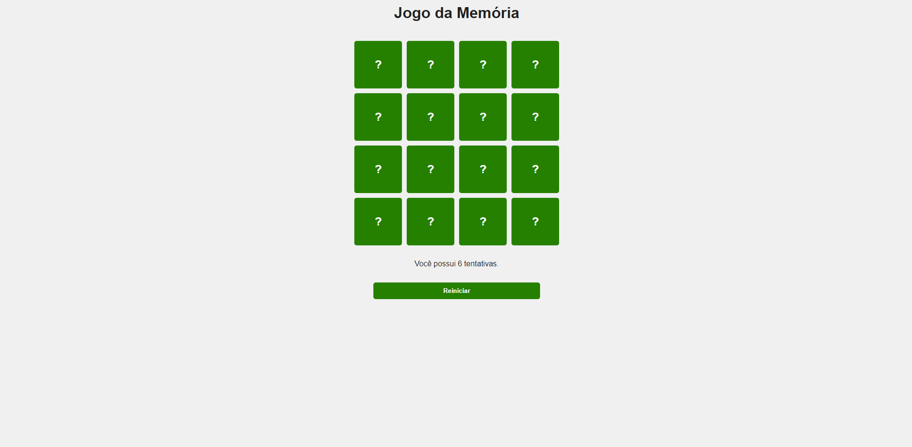
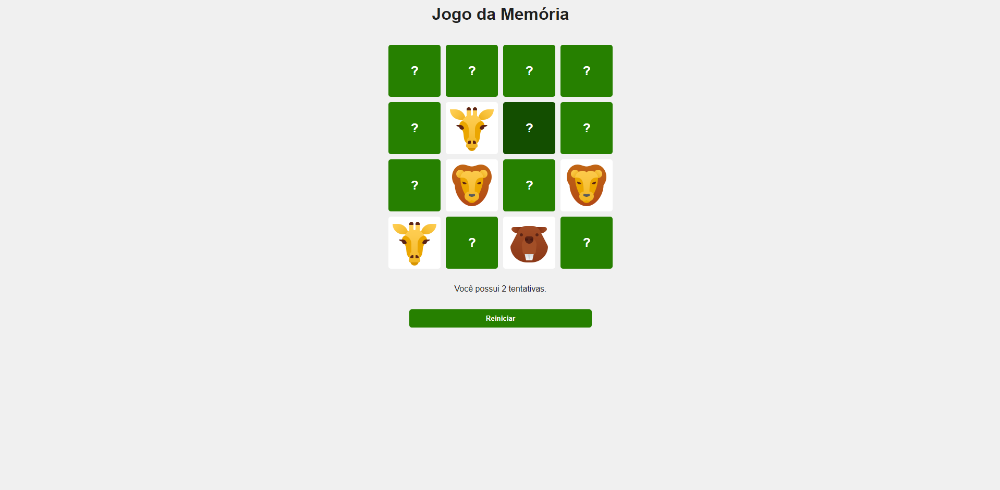
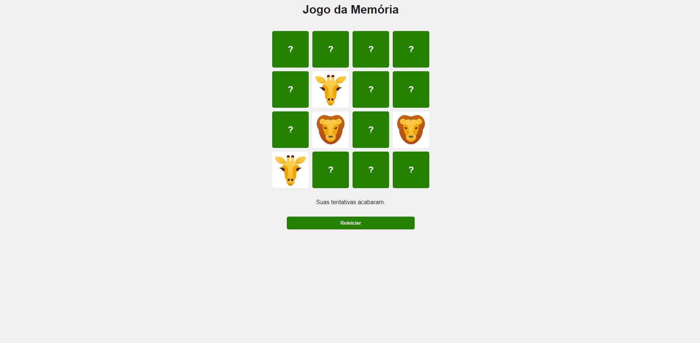
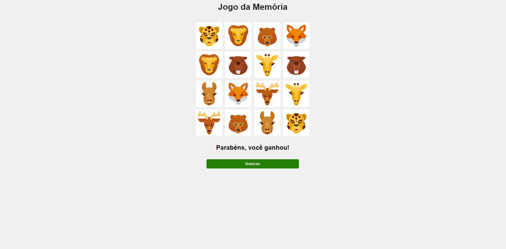

# Projeto de Jogo da Memória

## Descrição

Projeto Jogo da Memória desenvolvido utilizando React, JavaScript, HTML e CSS. A criação do projeto tem como objetivo principal a prática da lógica de programação. Os jogadores irão ter uma experiência interativa que desafia a memória.

## Funcionalidades

### Tabuleiro do Jogo

* Exibe uma grade de cartões virados para baixo, representando as peças do jogo.

* Ao clicar em um cartão, ele vira para cima, revelando seu conteúdo.

* Os jogadores devem fazer pares de cartões correspondentes.

### Contador de Tentativas

* Um contador de tentativas, que diminui ao relevar dois cartões diferentes.

### Botão Reiniciar

* Um botão que reinicia o jogo, embaralhando os cartões e resetando o contador de tentativas.

### Mensagem de Conclusão

* Quando todos os pares forem encontrados, exibir uma mensagem de parabéns.

## Tecnologias Utilizadas

* JavaScript
* HTML
* CSS
* ReactJS (para componentização e manipulação do estado)
* Front-end (foco na interface do usuário)

## Imagens

### Apresentando o Jogo:

### Jogo Rolando:

### Derrota:

### Vitória:

